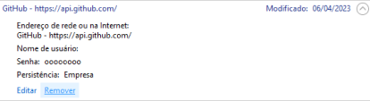

# git-commands
Comandos e testes

---
## Comandos básicos

Os comandos mais comuns do GitHub são:

| Comando | Descrição |
| ------- | --------- |
| `git add [nome-arquivo.txt]` | Define um arquivo para ser enviado no próximo commit |
| `git add -A` | Considera arquivos deletados e renomeados, atualizando o índice de acordo |
| `git add .` | Não considera arquivos deletados e não atualiza informações sobre arquivos renomeados |
| `git status` | Lista todos os arquivos alterados e indica quais serão enviados junto ao próximo commit |
| `git commit -m "[Mensagem de Commit]"` | Comita as alterações |
| `git commit -m "[Titulo]" -m "[Descrição]"` | Comita as alterações com uma descrição |

---
## Trocar ou Remover uma conta GitHub do Windows

Caso tenha uma conta GitHub e precisa trocar por outra ou atualizar os dados de uma conta, basta seguir esse guia.

### Passo 1: Acesse o Gerenciador de Credenciais do Windows

Existem várias maneiras de fazer isso:

- **Opção 1:** Clique no botão "Iniciar" e procure por "Gerenciar Credenciais do Windows" e clique no resultado correspondente.

- **Opção 2:** Acesse o "Painel de Controle" e procure por "Gerenciador de Credenciais" e depois "Credenciais do Windows" 

### Passo 2: Localizando as Credenciais do GitHub

Na janela de Gerenciamento de Credenciais, procure pela seção "Credenciais Genéricas". Role a lista até encontrar as credenciais relacionadas ao GitHub.

### Passo 3: Removendo as Credenciais do GitHub

Selecione as credenciais do GitHub que deseja remover e clique no botão "Remover". Confirme a remoção, se solicitado.

Repita esse processo para todas as credenciais do GitHub.

---
